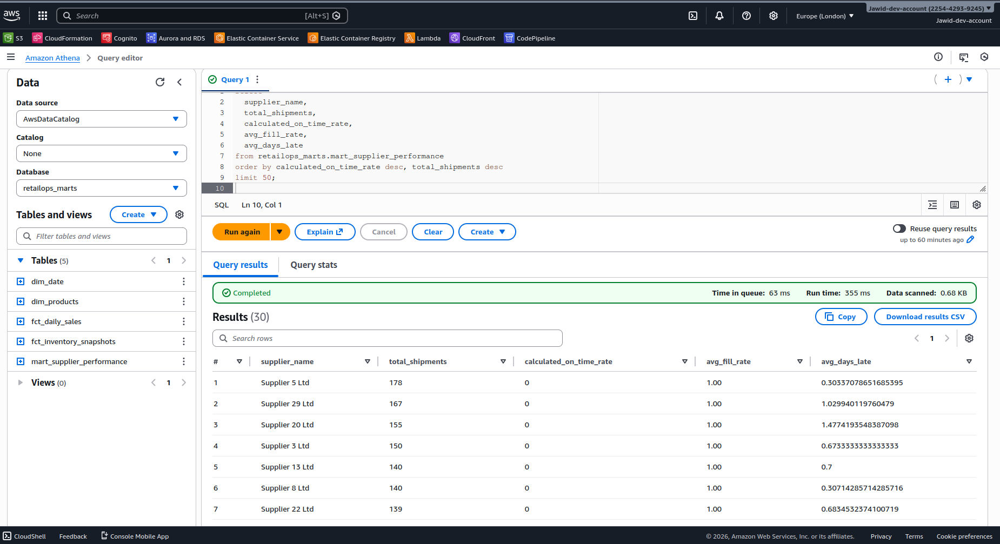
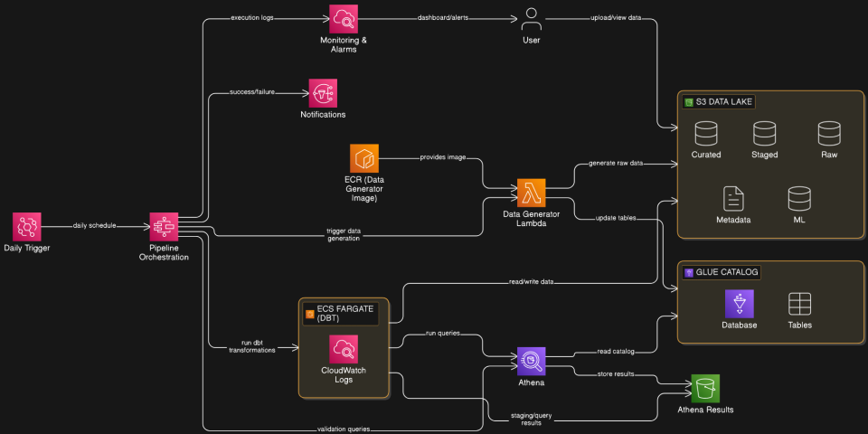

# RetailOps Data Platform

A retail analytics platform on AWS that I built to learn data engineering. Started with real data to understand the problem, then moved to synthetic data I could control. Built the whole thing: infrastructure, pipelines, transformations, orchestration.

**Stack**: S3, Glue, Athena, Lambda, ECS Fargate, Step Functions, dbt, CloudFormation

## Why This Project

I wanted to build something real - not just follow a tutorial. Something that shows I can design infrastructure, write good SQL, automate pipelines, and think about what actually matters in production.

## What I Did

### Week 1: Understanding the Domain (Favorita Dataset)

Started with the Kaggle Favorita dataset (grocery sales from Ecuador). Used it to understand retail analytics requirements and prove I could handle real messy data.

**DuckDB phase**:

* Loaded CSVs into DuckDB (fast for analytical queries)
* Built cleaning scripts, ran quality checks
* Created fact tables and tested them
* Found DuckDB doesn't integrate well with Metabase

**dbt (Postgres) phase**:

* Set up Postgres in Docker
* Built 6 staging models and a daily sales mart
* Connected to Metabase, created business dashboards
* Validated dimensional modeling approach


**R pipeline phase**:

* Data availability checks (row counts, missing tables)
* Data quality analysis using `DBI`, `RPostgres`, `dplyr`
* Statistical profiling with `pg_stats` (null fractions, distinct values, correlations)
* Comprehensive data cleaning:

  * Holiday events: parsed dates, classified event types
  * Items: handled categorical data, perishable flags
  * Oil prices: calculated price changes and trends
  * Stores: cleaned geography and store types
  * Transactions: validated daily transaction counts
  * Train/Test: engineered features (day of week, wage days, earthquake period)
* Data quality tests:

  * Uniqueness tests for primary keys
  * NOT NULL constraints
  * Referential integrity (foreign keys)
  * Range validation (quantities, prices)
  * Date range checks
* Built daily sales mart with R aggregations
* Generated analysis and HTML report with visualizations

All this work is preserved in `experiments/favorita-r-pipeline/` with full R scripts and outputs.

**Why I moved to synthetic data**:
The Favorita dataset has sales and products, but no inventory tracking, no suppliers, no shipments. Couldn't build a complete retail ops platform without supply chain data. So I wrote a Python generator to create realistic data with all the operational pieces I needed.

### Week 2: AWS Data Lake

Built the foundation on AWS. Everything as code with CloudFormation.

**S3 data lake** (`retops-s3datalake.yaml`):

* Bucket with versioning and encryption (AES256)
* Lifecycle policies (raw data transitions to IA after 30 days, staged after 90 days)
* Three zones: `raw/`, `curated/`, `metadata/`
* Public access blocked, all objects encrypted

**Glue catalog** (`retops-athena.yaml`):

* Created Glue database `retailops` pointing to S3 data lake
* 3 dimension tables: products, stores, suppliers (non-partitioned, stored in `raw/products/`, etc.)
* 3 fact tables: sales, inventory, shipments (partitioned by `dt=YYYY-MM-DD`)
* Partition projection configuration:

  * Type: date
  * Range: 2024-07-01 to NOW
  * Format: yyyy-MM-dd
  * Template: `s3://bucket/raw/sales/dt=${dt}/`
* All tables use OpenCSVSerde with proper quote/escape handling
* Created dedicated Athena workgroup with:

  * Query results bucket
  * Enforced output location
  * SSE_S3 encryption
  * CloudWatch metrics enabled

**IAM roles** (`retops-iam.yaml`):

* Pipeline role assumable by `ouadmin` user
* Least privilege permissions:

  * S3 data lake: ListBucket, GetBucketLocation, GetObject, PutObject
  * Athena results: ListBucket, GetBucketLocation, GetObject, PutObject, DeleteObject
  * Athena: StartQueryExecution, GetQueryExecution, GetQueryResults, StopQueryExecution, GetWorkGroup
  * Glue: GetDatabase, GetDatabases, GetTable, GetTables, GetPartition, GetPartitions

**Data upload** (`02_upload_raw_data_to_s3.py`):

* Idempotent upload script with S3 object existence checks
* Dimensions: single CSV per table (overwrites if exists)
* Facts: partitioned by date, skips existing partitions
* Metadata attached to S3 objects (upload timestamp, row counts, table type)
* Handled all 6 tables (3 dimensions + 3 facts)

Verified everything worked by querying in Athena:


### Week 3: dbt Transformation Layer

Migrated dbt from Postgres to Athena. Built proper dimensional models.

**Setup**:

* Installed `dbt-athena-community==1.8.2`
* Configured profiles with IAM role authentication (no hardcoded credentials)
* Set project to output Parquet with Snappy compression
* Configured Athena workgroup and S3 staging directory
* Added dbt to Docker with persistent `~/.dbt` profiles

**Staging models** (6 models):

* `stg_products` - cast types, handle nulls in supplier_id
* `stg_stores` - clean store attributes
* `stg_suppliers` - parse lead times and on-time rates
* `stg_sales` - cast numeric fields, handle discount nulls
* `stg_inventory` - handle negative quantities (data quality issue)
* `stg_shipments` - deduplicate 29 duplicate shipment_ids, cast dates
* Light transformations only: type casting, null handling, derived flags
* Materialized as views (no data duplication in staging)

**Source tests** (20+ tests):

* NOT NULL on all primary keys
* Unique constraints on dimension keys
* Relationships (foreign keys) validated
* Accepted values for categorical fields

**Mart models** (6 models):

* `dim_date` - calendar dimension (2024-07-01 to 2026-12-31)

  * Day/week/month/quarter/year attributes
  * Day of week names
  * Weekend flags
  * Fiscal attributes
* `dim_products` - product dimension with supplier denormalization

  * Product attributes
  * Category/subcategory
  * Cost and pricing
  * Supplier details (name, country, lead time)
* `dim_stores` - store master

  * Store attributes
  * Geography (region)
  * Store type and cluster
* `fct_daily_sales` - sales fact (store-product-day grain)

  * Quantity sold
  * Pricing and discounts
  * Total sales amount
  * Profit calculations
  * Foreign keys to all dimensions
* `fct_inventory_snapshots` - inventory fact (store-product-day grain)

  * Quantity on hand
  * Quantity on order
  * Reorder points
  * Inventory value calculations
  * Stockout flags
* `mart_supplier_performance` - aggregated supplier metrics

  * Total shipments and orders
  * On-time delivery rate
  * Fill rate (quantity received vs ordered)
  * Average lead time
  * Late shipment counts

All marts materialized as Parquet tables in `curated/` zone.

**Tests** (53 total, all passing):

* Primary key uniqueness for all dimensions
* Grain validation for facts (unique date-store-product combinations)
* Foreign key relationships (all references valid)
* Business rules:

  * Quantities >= 0
  * Prices > 0
  * Dates in valid ranges
  * Lead times positive
  * Rates between 0 and 1


**Analysis queries**:

* Revenue and profit by category
* Top 10 products by sales
* Store performance rankings
* Supplier scorecards with ratings




### Week 4: Orchestration with Step Functions

Automated the entire pipeline end-to-end. This required the most debugging.

**Lambda data generator** (`retops-ecr-data-generator.yaml` + `retops-lambda-data-generator.yaml`):

* ECR repository for Lambda container image
* IAM role for Lambda with S3 write permissions to data lake
* Lambda function specification:

  * Package type: Image (not zip)
  * Architecture: x86_64
  * Memory: 1024 MB
  * Timeout: 300 seconds (5 minutes)
* Container image built with:

  * Python 3.12 base
  * Data generator code (`app.py`, `generator.py`)
  * Dependencies: pandas, boto3, numpy
* Lambda handler reads date from event payload
* Generates synthetic data for that date:

  * Sales: ~50K rows/day across stores and products
  * Inventory: ~4K snapshots/day
  * Shipments: ~200 shipments/day
* Uploads with partitioning: `raw/sales/dt=YYYY-MM-DD/sales.csv`
* Returns row counts for validation
* Fixed bug: initial version created 0 shipments due to inventory logic

**ECS dbt runner** (`retops-ecs-dbt.yaml`):

* ECS Fargate cluster: `retailops-dev-dbt-cluster`
* CloudWatch log group: `/ecs/retailops/dev/dbt` (14 day retention)
* Task execution role (for pulling images, writing logs)
* Task role with permissions:

  * S3 data lake: ListBucket, GetObject, PutObject, DeleteObject
  * Athena results bucket: same as above
  * Athena: all query execution actions
  * Glue: full catalog access (create/update/delete tables)
* Task definition:

  * Fargate, 1 vCPU, 2 GB memory
  * 40 GB ephemeral storage
  * Custom Docker image: `retailops-dbt-athena:1.8.2`

    * Base: python:3.12-slim
    * Installed: dbt-core==1.8.2, dbt-athena-community==1.8.2, boto3
  * Container command:

    1. Install boto3 for S3 downloads
    2. Create dbt profiles.yml with Athena config
    3. Download dbt project zip from S3 (`metadata/dbt/dbt_athena.zip`)
    4. Extract with error handling
    5. Run `dbt deps`
    6. Run `dbt run` (materializes all models)
    7. Run `dbt test` (validates data quality)
  * All output to CloudWatch logs

**Step Functions state machine** (`retops-step-functions.yaml`):

* State machine name: `retailops-daily-pipeline`

* 6 states:

  1. **ExtractDate**: Parse date from EventBridge time field
  2. **GenerateData**: Invoke Lambda with parsed date

     * Resource: `arn:aws:states:::lambda:invoke`
     * Catch errors → jump to NotifyFailure
  3. **RunDbt**: Execute ECS task synchronously

     * Resource: `arn:aws:states:::ecs:runTask.sync`
     * Launch type: FARGATE
     * Network: 2 subnets + security group + public IP
     * Waits for task completion
     * Catch errors → jump to NotifyFailure
  4. **AthenaValidation**: Run quality check query

     * Resource: `arn:aws:states:::athena:startQueryExecution.sync`
     * Query: `SELECT max(sale_date), count(*) FROM retailops_marts.fct_daily_sales WHERE sale_date >= current_date - interval '7' day`
     * Workgroup: retailops-primary
     * Catch errors → jump to NotifyFailure
  5. **NotifySuccess**: Publish to SNS success topic
  6. **NotifyFailure**: Publish to SNS failure topic → FailState

* IAM execution role with permissions:

  * Lambda: InvokeFunction
  * ECS: RunTask, StopTask, DescribeTasks
  * IAM: PassRole (for ECS task role)
  * Athena: StartQueryExecution, GetQueryExecution, GetQueryResults
  * Glue: GetDatabase, GetTable, GetPartitions
  * S3: ListBucket, GetObject, PutObject (Athena results bucket)
  * SNS: Publish (both topics)
  * EventBridge: PutRule, PutTargets, DescribeRule, DeleteRule, RemoveTargets (for ECS .sync integration)

* SNS topics:

  * Success topic: `retailops-pipeline-success`
  * Failure topic: `retailops-pipeline-failure`
  * Email subscription on failure topic

* EventBridge schedule:

  * Cron: `0 6 * * ? *` (daily 6am UTC)
  * State: ENABLED
  * Input transformer passes current timestamp to state machine

**Debugging iterations**:

* Step Functions → Lambda: Initially wasn't passing date correctly, fixed with InputPathsMap
* Step Functions → ECS: `.sync` integration requires EventBridge rule creation permissions
* ECS container: dbt project unzip was failing silently, added verbose logging and error checking
* Athena validation: Step Functions role was missing Glue catalog permissions
* IAM roles: 3 full redeploys to get all cross-service permissions right
* Lambda: Had to use `--platform linux/amd64` in Docker build for Lambda compatibility

**CloudWatch monitoring** (`retops-cloudwatch.yaml`):

* Dashboard: `retailops-pipeline-health`

  * Widget 1: Step Functions execution metrics (succeeded, failed, started)
  * Widget 2: Recent dbt errors from logs (filters for ERROR|FAIL)
* Alarm: `retailops-pipeline-failure`

  * Metric: ExecutionsFailed
  * Threshold: >= 1
  * Period: 5 minutes
  * Action: Publish to failure SNS topic

Pipeline now runs daily:

```
EventBridge (6am UTC)
  → Step Functions
    → Lambda generates data (30 sec)
    → ECS runs dbt (5 min)
      → staging models (views)
      → mart models (Parquet tables)
      → 53 tests
    → Athena validates (3 sec)
    → SNS emails result
```

### Daily Pipeline Architecture Diagram

To make the orchestration and service interactions clearer, here is the full architecture diagram of the daily pipeline:



This diagram shows how the services interact end-to-end:

- **Amazon EventBridge** triggering the workflow daily at 6am UTC  
- **AWS Step Functions** orchestrating the workflow states  
- **AWS Lambda** generating synthetic retail data  
- **Amazon S3** storing raw and curated datasets  
- **Amazon ECS (Fargate)** running dbt transformations  
- **Amazon Athena** validating and querying transformed data  
- **Amazon SNS** sending success/failure notifications  
- **Amazon CloudWatch** collecting logs, metrics, and alarms  

The architecture follows a medallion-style data pattern:

1. **Raw zone (S3)** — Partitioned synthetic operational data lands daily  
2. **Staging layer (dbt views)** — Type casting and light transformations  
3. **Curated zone (Parquet tables)** — Dimensional models and fact tables  
4. **Validation layer (Athena + dbt tests)** — Data quality and business rule enforcement  
5. **Monitoring & Alerts (CloudWatch + SNS)** — Operational reliability  

This keeps the system modular, idempotent, production-ready, and fully automated.


## Current State

**What works**:

* 9 CloudFormation stacks deployed
* Daily pipeline running successfully
* 12 dbt models with 53 tests passing
* Data queryable in Athena (<3 sec queries)
* Email alerts when things break

**What's next**:

* Week 5: Metabase dashboards for business users
* Week 6: Demand forecasting model

## Design Decisions

**Why Athena?**: Serverless, pay-per-query. My usage costs $2/month vs $180/month for Redshift.

**Why ECS for dbt?**: Lambda 15min timeout is too tight. ECS gives me control and full logs.

**Why Step Functions?**: Native AWS integrations, visual workflow, costs $0.50/month. Way easier than managing Airflow.

**Why partition projection?**: Queries with date filters are instant. No Glue crawlers needed.

**Why synthetic data?**: Real dataset was incomplete. Needed inventory, suppliers, shipments to build something meaningful.

## Cost

Running about $10/month:

* Lambda: $0.50
* Fargate: $5
* Athena: $2
* S3: $0.50
* CloudWatch: $1
* Step Functions: $0.50
* SNS: $0.01

## Setup

Deploy infrastructure:

```bash
cd infrastructure
./deploy-all-cfn-stacks.sh
```

Upload dbt project:

```bash
cd scripts
./03_upload_dbt_project_to_s3.sh
```

Build and push Lambda image:

```bash
cd lambda_functions/data_generator
./push_image.sh
```

Trigger manually:

```bash
aws stepfunctions start-execution \
  --state-machine-arn <arn> \
  --input '{"date":"2025-01-18"}'
```

## Repository Structure

```
infrastructure/cfn/          # 9 CloudFormation stacks
dbt_athena/models/          # 12 dbt models (staging + marts)
lambda_functions/           # Data generator
scripts/                    # Upload and deployment scripts
experiments/                # Week 1 work with Favorita dataset
  └── favorita-r-pipeline/  # Complete R analysis pipeline
```

---

Built this to learn by doing. Made mistakes, fixed them, learned what actually matters.
