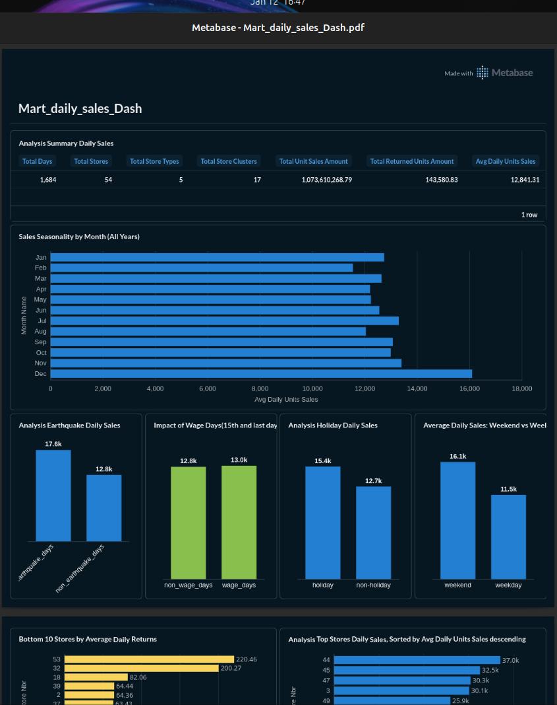
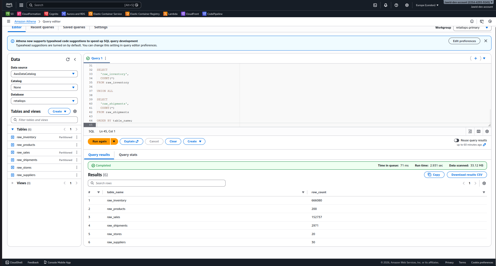

# RetailOps Companion

Work in progress: building a retail analytics platform with a local Postgres + dbt stack and an AWS data lake footprint.

## Current status

* [X] Week 1  — Local analytics stack (Favorita + Postgres + dbt + Metabase + R checks) 
* [X] Week 2           Synthetic data + AWS data lake  Implemented 
* [X] Week 3           dbt transformation layer (Athena / Glue-backed models + tests)
* [ ]Week 3 Part II - Planned— Orchestration + monitoring  
* Week 5 Planned— Analytics + BI layer  
* Week 6 Planned— ML (demand forecasting)  

## Tech stack

Implemented

* Postgres
* dbt (dbt-postgres)
* Metabase
* Python
* SQL
* R
* Docker / Docker Compose
* AWS CloudFormation (S3 / Glue / Athena / IAM templates)

Planned

* Orchestration (scheduled runs, retries, notifications)
* Monitoring and alerting
* Forecasting / ML

## Repo At A Glance

* `requirements.txt`
* `data/synthetic/` raw_data
* `dbt_athena/retailops_athena/models/` stage,dimensions,fact and mart queries
* `infrastructure/cfn/` CloudFormation
* `scripts/`

## Current Architecture (WIP)

- S3 data lake 
- Glue Data Catalog + Athena: templates for serverless queryingtemplate that is still focused on S3 while Athena/Glue permissions are being finalized.

## Week 1 — Local analytics stack (Favorita + Postgres + dbt + Metabase & R )

Ship a complete local workflow: raw data → checks → dbt models → dashboard export.

#### What I did

* Loaded Favorita CSVs into Postgres (raw schema).
* Ran R scripts for data availability checks + quality checks, and generated a report.
* Built dbt staging models and a daily sales mart.
* Built charts in Metabase and exported the dashboard.

#### Evidence (R report)

* Source: `experiments/favorita-r-pipeline/R/reports/week1_report.Rmd`
* HTML: `experiments/favorita-r-pipeline/R/reports/week1_report.html`
* Screenshot: `experiments/favorita-r-pipeline/R/reports/week1-R-dashboard-Screenshot.png`

#### Evidence (Metabase exports)

* PNG: `output/week1-dbt-metabase/Metabase_Mart_daily_sales_Dash.png`
* PDF: `output/week1-dbt-metabase/Metabase_Mart_daily_sales_Dash.pdf`

### Week 2 — Synthetic data + AWS data lake (implemented, execution proof TODO)

#### Goal

Extend the project beyond Favorita by adding retail ops concepts (orders/inventory/shipping), then build a cloud-friendly data lake foundation.

#### What I did

* Added a synthetic data generator to create operational datasets (products, stores, suppliers, sales, inventory, shipments).
* Wrote an S3 upload path that supports dimension uploads and date-partitioned fact data.
* Built CloudFormation templates for the AWS footprint (S3 + Glue + Athena + IAM).

#### Evidence (synthetic data + upload scripts)

* Generator: `scripts/01_generate_synthetic_data.py`
* Outputs: `data/synthetic/*.csv`
* Upload script: `scripts/02_upload_to_s3.py`
* Week 2 Athena Query example

#### Evidence (CloudFormation)

* Templates: `infrastructure/cfn/retops-*.yaml`
* Deploy script: `infrastructure/deploy-all-cfn-stacks.sh`

### Week 3 — dbt transformation layer (planned)

Goal: expand modeling beyond one mart and formalize transformations (more marts, clearer grains, tests).

Planned deliverables:

* More marts (inventory daily, supplier performance, order fulfillment)
* dbt tests (not null, unique, relationships)
* Documentation and model contracts (where useful)

### Week 4 — Orchestration + monitoring (planned)
### Week 5 — Analytics + BI layer (planned)
### Week 6 — ML (demand forecasting) (planned)