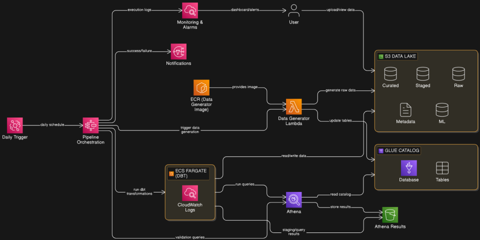

# RetailOps Stock Signal

<!-- TAB: overview -->

## Technical Summary

A serverless retail analytics platform on AWS, fully automated and deployed as infrastructure-as-code across 9 CloudFormation stacks. A containerized Lambda function generates daily synthetic retail data and uploads it to a partitioned S3 data lake. AWS Step Functions orchestrates the end-to-end pipeline — Lambda → ECS Fargate (dbt) → Athena validation → ECS Fargate (ML) → SNS — running daily without manual intervention. dbt transforms raw CSV data into Parquet-backed dimensional models in Athena, enforced by 53 automated data quality tests. A LightGBM demand forecasting model trained with walk-forward cross-validation and Optuna hyperparameter tuning generates 7-day-ahead predictions per store × product, feeding a statistical reorder recommendation engine. The full pipeline has been executed end-to-end and all outputs verified in production.

**Stack:** AWS Lambda · ECS Fargate · Step Functions · S3 · Glue Data Catalog · Athena · dbt-athena · CloudFormation · CloudWatch · SNS · ECR · LightGBM · Optuna · SHAP · Python 3.12

---

## Plain English Summary

This platform automatically processes retail business data every day — tracking sales, stock levels, and supplier shipments across 20 stores and 200 products. It cleans and organises that data into structured reports, then uses a machine learning model to forecast demand for the next 7 days and calculate exactly how much stock each store should order before running out. The entire system runs on AWS, starts itself on a schedule, sends an email when it completes, and costs roughly $10 per month to operate. It has been run end-to-end and produced verified reorder recommendations for 1,942 store-product combinations.

---

<!-- TAB: architecture -->

## Architecture



```
EventBridge (06:00 UTC daily)
  └─► Step Functions
        ├─► Lambda              — generates ~55K rows of synthetic retail data for the day
        ├─► ECS Fargate (dbt)   — staging views → Parquet mart tables → 53 quality tests
        ├─► Athena              — validates that the new partition landed with rows
        ├─► ECS Fargate (ML)    — features → train → evaluate → reorder recommendations
        └─► SNS                 — emails success or failure with execution context
```

### Why each service was chosen

| Service | Role | Rationale |
|---|---|---|
| **Lambda** | Daily data generation | Stateless, event-driven, no infrastructure to manage |
| **S3** | Data lake — raw, curated, ML zones | Durable, cheap, native to Athena and Glue |
| **Glue Data Catalog** | Schema registry | Partition projection eliminates crawler runs; new partitions are instantly queryable |
| **Athena** | Query engine and validation | Serverless, pay-per-query, ~$2/month at this scale |
| **ECS Fargate** | dbt and ML execution | Lambda's 15-minute limit is insufficient; Fargate provides unconstrained execution with full CloudWatch log streaming |
| **Step Functions** | Pipeline orchestration | Native `.sync` integrations with Lambda, ECS, and Athena; visual execution graph; ~$0.50/month |
| **CloudFormation** | Infrastructure provisioning | All 9 stacks version-controlled, reproducible, and deployable in a single script |
| **CloudWatch** | Logs, metrics, alarms | Centralized observability; failure alarm fires within 5 minutes |
| **SNS** | Alerting | Decoupled notification layer; email subscription on both success and failure topics |

### ADR-001 — Step Functions over Airflow

**Context:** The pipeline requires sequential execution of Lambda, ECS, and Athena with failure routing at each step.

**Decision:** AWS Step Functions with native `.sync` SDK integrations.

**Consequences:**
- No infrastructure to manage — no Airflow cluster, scheduler, or worker nodes
- Native integrations eliminate polling logic for ECS and Athena task completion
- Visual execution graph provides an audit trail without additional tooling
- Cost is ~$0.50/month at one execution per day
- Workflow logic lives in ASL (JSON), not Python — less flexible for complex branching
- Vendor lock-in to AWS; migrating would require rewriting the DAG

### ADR-002 — Athena over Redshift

**Context:** A query engine is needed to serve both the dbt transformation layer and the ML feature engineering queries.

**Decision:** Amazon Athena with Glue Data Catalog and partition projection.

**Consequences:**
- Serverless, pay-per-query — ~$2/month vs ~$180/month for the smallest Redshift cluster
- Partition projection on all date-partitioned fact tables eliminates crawler runs and makes new partitions instantly queryable
- No cluster to maintain, resize, or pause
- Query latency is higher than a warehouse for complex joins at large scale — acceptable for a daily batch workload

### ADR-003 — ECS Fargate for dbt and ML

**Context:** Both dbt (run + test cycle) and the ML pipeline (Optuna tuning over 65K rows) exceed Lambda's 15-minute execution limit.

**Decision:** ECS Fargate with task definitions pulled from ECR; code bundles downloaded from S3 at runtime.

**Consequences:**
- Unconstrained execution time — dbt completes in ~6 minutes, ML in ~30 minutes
- Full stdout/stderr streams to CloudWatch Logs automatically
- No persistent infrastructure between runs — tasks spin up and terminate
- Code is decoupled from the image: updating the ML scripts requires only re-uploading a zip to S3, not rebuilding the container

---

<!-- TAB: data -->

## Data Flow

```
1. GENERATE   Lambda reads dimension CSVs from S3 (products, stores, suppliers)
              and generates daily fact data:
                raw/sales/dt=YYYY-MM-DD/sales.csv         (~50K rows, ~504 on 2026-02-11)
                raw/inventory/dt=YYYY-MM-DD/inventory.csv (~4K rows, 3,680 on 2026-02-11)
                raw/shipments/dt=YYYY-MM-DD/shipments.csv (~200 rows, 1,237 on 2026-02-11)

2. CATALOG    Glue Data Catalog exposes all raw tables to Athena via partition projection.
              No crawlers. New partitions are queryable immediately after Lambda writes them.

3. TRANSFORM  ECS Fargate downloads the dbt project zip from S3, builds profiles.yml
              at runtime from environment variables (no credentials in the image), then:
                dbt run   → 6 staging views (type casting, null handling, deduplication)
                          → 5 mart Parquet tables written to curated/ zone
                dbt test  → 53 tests: PK uniqueness, FK integrity, business rules

4. VALIDATE   Step Functions invokes Athena to confirm the pipeline date partition
              landed with rows in fct_daily_sales before proceeding to ML.

5. ML         ECS Fargate downloads the ML code zip from S3 and runs four stages:
                features.py              → 67,803-row feature matrix → S3 Parquet
                train.py                 → walk-forward CV + Optuna → LightGBM → S3
                evaluate.py              → metrics + forecasts → S3
                reorder_recommendations.py → safety stock + order quantities → S3

6. NOTIFY     SNS publishes success or failure with the execution date and error context.
```

### S3 Zone Layout

```
s3://retailops-data-lake-eu-west-2/
├── raw/
│   ├── products/products.csv
│   ├── stores/stores.csv
│   ├── suppliers/suppliers.csv
│   ├── sales/dt=YYYY-MM-DD/sales.csv
│   ├── inventory/dt=YYYY-MM-DD/inventory.csv
│   └── shipments/dt=YYYY-MM-DD/shipments.csv
├── curated/                              ← dbt mart output (Parquet / Snappy)
│   ├── dim_date/
│   ├── dim_products/
│   ├── dim_stores/
│   ├── fct_daily_sales/
│   ├── fct_inventory_snapshots/
│   └── mart_supplier_performance/
├── ml/                                   ← ML pipeline output
│   ├── features/features.parquet         (2.8 MB, 67,803 rows × 48 columns)
│   ├── models/demand_forecast_lgbm_v1.pkl          (22 MB, 7 horizon models)
│   ├── models/demand_forecast_lgbm_v1_metadata.json
│   ├── forecasts/dt=2026-02-11/forecasts.parquet   (13,594 rows)
│   ├── reorder_recommendations/dt=2026-02-11/recommendations.parquet (1,942 rows)
│   └── evaluation/eval_2026-02-11.json
└── metadata/
    ├── dbt/dbt_athena.zip                ← dbt project bundle for ECS
    └── ml/ml_pipeline.zip                ← ML code bundle for ECS
```

---

<!-- TAB: dbt -->

## dbt Models

### Staging — materialized as views

| Model | Key transformations |
|---|---|
| `stg_products` | Type casting, null handling on `supplier_id` |
| `stg_stores` | Attribute cleaning, region normalization, `Unknown` fallback |
| `stg_suppliers` | Lead time and on-time rate parsing |
| `stg_sales` | Numeric casting, discount null coalescing, `discount_rate` derivation |
| `stg_inventory` | Negative quantity handling, `is_out_of_stock` / `needs_reorder` / `is_slow_moving` flags |
| `stg_shipments` | Deduplication via `ROW_NUMBER()` on `shipment_id`, date casting, `fill_rate` and `days_late` derivation |

### Marts — materialized as Parquet tables in `curated/`

| Model | Grain | Description |
|---|---|---|
| `dim_date` | Day | Calendar dimension with fiscal attributes, weekend flags, day-of-week names |
| `dim_products` | Product | Product attributes denormalized with supplier details and margin calculations |
| `dim_stores` | Store | Store master with geography, format, and size category |
| `fct_daily_sales` | Store × Product × Day | Quantity, pricing, discounts, profit, profit margin |
| `fct_inventory_snapshots` | Store × Product × Day | On-hand, on-order, reorder points, inventory value, stockout flags |
| `mart_supplier_performance` | Supplier | On-time rate (calculated vs master data), fill rate, lead time, late shipment count, variance |

### Data Quality — 53 tests

- Primary key uniqueness on all dimension and fact grain combinations
- Foreign key relationships validated across all fact-to-dimension joins
- Business rule enforcement: quantities ≥ 0, prices > 0, rates between 0 and 1
- Source-level NOT NULL constraints on all primary and foreign keys
- Accepted values enforcement on categorical fields (region, store type, product status)

---

<!-- TAB: ml -->

## ML Layer — Demand Forecasting and Reorder Intelligence

The ML layer replaces the deterministic stockout risk score with a forward-looking forecast. Where the risk score uses trailing 30-day average demand, the ML layer predicts demand for each of the next 7 days. Where the risk score ignores demand variance, the ML layer incorporates it through a statistical safety stock formula.

### Feature Engineering

`ml/features.py` reads all mart tables from Athena and builds one row per store × product × date with 36 numeric features and 5 categorical features:

| Feature group | Features |
|---|---|
| Lag features | `lag_1`, `lag_7`, `lag_14`, `lag_28` |
| Rolling statistics | Mean, std, min, max over 7 / 14 / 28-day windows |
| Exponentially weighted mean | `ewm_mean_7`, `ewm_mean_14` |
| Demand trend | OLS slope over trailing 14 days |
| Promotion signals | `has_discount`, `discount_pct`, `price_vs_30d_avg` |
| Calendar | `day_of_week`, `month_of_year`, `is_weekend`, `days_since_period_start` |
| Inventory state | `quantity_on_hand`, `quantity_on_order`, `reorder_point`, `needs_reorder`, `stockout_freq_14d`, `days_of_stock_remaining` |
| Supplier reliability | `avg_actual_lead_time_days`, `calculated_on_time_rate`, `avg_fill_rate` |
| Cross-store signal | `region_avg_demand_7d` — average demand for this product across all stores in the same region |
| Categorical | `store_id`, `product_id`, `region`, `store_type`, `category` |

**Feature matrix from the 2026-02-11 run:** 67,803 rows × 48 columns · 65,861 labelled training rows · 1,942 inference rows (last date per series, target=NaN, used for forecasting)

### Model Design

**Direct multi-step forecasting.** One LightGBM model per horizon day (h=1…7). Each model predicts demand h days ahead using features computed at the time of forecasting. This avoids error accumulation from recursive forecasting and allows each horizon to learn different feature relationships.

**Walk-forward cross-validation.** Four expanding-window folds anchored to the actual data range (2025-07-01 → 2026-02-10):

| Fold | Train through | Validate |
|---|---|---|
| 1 | 2025-10-28 | 2025-10-29 → 2025-11-04 |
| 2 | 2025-11-25 | 2025-11-26 → 2025-12-02 |
| 3 | 2025-12-23 | 2025-12-24 → 2025-12-30 |
| 4 | 2026-01-26 | 2026-01-27 → 2026-02-02 |

Fold 4's validation window is the 7 days immediately before the final 7 labelled days — the closest possible proxy for the actual prediction task.

**WAPE as primary metric.** Weighted Absolute Percentage Error weights errors by volume. A 10-unit error on a 10-unit SKU is catastrophic; the same error on a 1,000-unit SKU is negligible. RMSE treats both identically.

**Optuna hyperparameter tuning.** 50 trials of TPE-sampled search over `num_leaves`, `learning_rate`, `min_child_samples`, `feature_fraction`, `bagging_fraction`, `reg_alpha`, `reg_lambda`.

### Reorder Recommendation Formula

```
safety_stock          = z × σ_demand × √(effective_lead_time)
reorder_point         = forecast_demand_over_lead_time + safety_stock
recommended_order_qty = max(0, reorder_point − quantity_on_hand − quantity_on_order)

effective_lead_time   = avg_actual_lead_time_days / on_time_rate
z                     = 1.65  (95% service level)
σ_demand              = std dev of daily demand over trailing 14 days
```

The `√L` term accounts for demand uncertainty compounding over the lead time. Dividing lead time by on-time rate penalises unreliable suppliers — a supplier with a 10-day lead time and 50% on-time rate is treated as a 20-day supplier for planning purposes.

**Risk tiers:**

| Tier | Condition |
|---|---|
| Critical | `quantity_on_hand < safety_stock` — already inside the safety buffer |
| High | `quantity_on_hand < reorder_point` — below reorder point |
| Medium | `days_of_stock_remaining < effective_lead_time × 1.5` — approaching reorder point |
| Low | All other combinations |

---

<!-- TAB: results -->

## Pipeline Run Results — 2026-02-11

The full pipeline was executed end-to-end via AWS Step Functions on 2026-04-23. All four stages completed successfully. Results are verified from S3 outputs.

### Pipeline Execution Summary

| Stage | Status | Key output |
|---|---|---|
| GenerateData (Lambda) | ✅ Success | 504 sales rows · 3,680 inventory rows · 1,237 shipment rows written to S3 |
| RunDbt (ECS Fargate) | ✅ Success | 11 models materialized · 53 tests passed · Parquet marts written to `curated/` |
| AthenaValidation | ✅ Success | 2026-02-11 partition confirmed present in `fct_daily_sales` |
| RunMlPipeline (ECS Fargate) | ✅ Success | Features → Training → Evaluation → Reorder recommendations |
| NotifySuccess (SNS) | ✅ Success | Email delivered |

### Feature Engineering

| Metric | Value |
|---|---|
| Training date range | 2025-08-24 → 2026-02-11 |
| Feature matrix size | 67,803 rows × 48 columns |
| Labelled training rows | 65,861 |
| Inference rows (2026-02-10 features) | 1,942 |
| Store-product pairs | 1,942 |
| Feature file size | 2.8 MB (Parquet, S3) |

### Model Training

| Metric | Value |
|---|---|
| Model version | v1 |
| Horizons trained | h=1 through h=7 (7 independent models) |
| Optuna trials | 50 |
| Best CV WAPE (Optuna) | 0.421 |
| Model file size | 22 MB (pickle, S3) |

**Best hyperparameters found by Optuna:**

```
num_leaves:        69
learning_rate:     0.173
min_child_samples: 38
feature_fraction:  0.799
bagging_fraction:  0.578
reg_alpha:         0.00042
reg_lambda:        0.00017
objective:         regression_l1
```

### Walk-Forward Evaluation

Evaluated across 2 folds with sufficient validation data. Overall mean WAPE: **0.454**

| Horizon | WAPE | RMSE | Bias |
|---|---|---|---|
| h=1 (next day) | 0.438 | 1.018 | -0.175 |
| h=2 | 0.449 | 1.031 | -0.182 |
| h=3 | 0.455 | 1.039 | -0.157 |
| h=4 | 0.462 | 1.049 | -0.138 |
| h=5 | 0.445 | 1.040 | -0.202 |
| h=6 | 0.459 | 1.191 | -0.305 |
| h=7 | 0.469 | 1.748 | -1.312 |

*Values are means across folds. Fold 1 has fewer observations at longer horizons due to the expanding-window structure.*

### Error Analysis by Segment

**By product category:**

| Category | WAPE | RMSE | n |
|---|---|---|---|
| Home Goods | 0.340 | 0.591 | 60 |
| Apparel | 0.374 | 0.797 | 629 |
| Groceries | 0.419 | 0.971 | 2,075 |

**By store type:**

| Store type | WAPE | RMSE | n |
|---|---|---|---|
| Flagship | 0.395 | 0.906 | 856 |
| Outlet | 0.404 | 0.990 | 846 |
| Standard | 0.424 | 0.891 | 1,062 |

**By demand level:**

| Demand level | WAPE | RMSE | n |
|---|---|---|---|
| Medium | 0.238 | 0.564 | 667 |
| Low | 0.456 | 0.558 | 1,643 |
| High | 0.507 | 1.907 | 454 |

The model performs best on medium-demand SKUs. High-demand SKUs show higher absolute error (RMSE 1.907) due to larger demand magnitudes, though WAPE is volume-weighted so this is expected. Low-demand SKUs show positive bias — the model slightly over-forecasts near-zero demand, which is the conservative direction for inventory planning.

### Demand Forecasts

| Metric | Value |
|---|---|
| Total forecast rows | 13,594 |
| Store-product pairs covered | 1,942 |
| Forecast horizon | 2026-04-18 → 2026-04-24 (h=1 through h=7) |
| Average predicted daily demand (h=1) | 1.47 units |
| Average predicted daily demand (h=7) | 1.54 units |
| Output file | `ml/forecasts/dt=2026-02-11/forecasts.parquet` (77 KB) |

### Reorder Recommendations

| Metric | Value |
|---|---|
| Total recommendations | 1,942 |
| Critical (order immediately) | 1,031 (53%) |
| High (order today) | 852 (44%) |
| Medium (monitor closely) | 49 (3%) |
| Low (sufficient stock) | 10 (1%) |
| Output file | `ml/reorder_recommendations/dt=2026-02-11/recommendations.parquet` (112 KB) |

The high proportion of Critical and High tiers reflects the synthetic data generator's design: inventory is intentionally initialised at or below reorder points to produce realistic replenishment events. In a production deployment with real inventory data, the distribution would shift toward Medium and Low as stock levels stabilise.

**Sample Critical recommendations (lowest days of stock remaining):**

| Store | Product | On Hand | Days of Stock | Recommended Order | Lead Time (days) |
|---|---|---|---|---|---|
| S001 | P0074 | 0 | 0.0 | 1,334 | 9.4 |
| S014 | P0091 | 0 | 0.0 | 3,002 | 18.6 |
| S014 | P0182 | 0 | 0.0 | 3,612 | 16.9 |
| S014 | P0195 | 0 | 0.0 | 3,154 | 20.4 |

---

<!-- TAB: structure -->

## Repository Structure

```
infrastructure/
├── cfn/                              # 9 CloudFormation stacks — deploy in order
│   ├── retops-s3datalake.yaml        # S3 data lake with encryption, versioning, lifecycle
│   ├── retops-athena.yaml            # Glue catalog, partitioned tables, Athena workgroup
│   ├── retops-iam.yaml               # Least-privilege pipeline IAM role
│   ├── retops-ecr-data-generator.yaml
│   ├── retops-ecr-ml.yaml            # ECR repo + IAM roles for ML ECS task
│   ├── retops-lambda-data-generator.yaml
│   ├── retops-ecs-dbt.yaml           # ECS cluster + dbt Fargate task definition
│   ├── retops-ecs-ml.yaml            # ECS ML Fargate task definition
│   ├── retops-step-functions.yaml    # State machine + EventBridge schedule + SNS topics
│   └── retops-cloudwatch.yaml        # Dashboard + failure alarm
├── docker/
│   ├── dbt_athena/Dockerfile         # dbt-athena container image
│   └── Dockerfile.ml                 # ML container image (LightGBM, Optuna, SHAP, pyarrow)
├── lambda_functions/data_generator/
│   ├── app.py                        # Lambda handler
│   └── generator.py                  # Synthetic data generator (Poisson demand, seasonality)
└── deploy-all-cfn-stacks.sh          # Ordered deployment script

dbt_athena/retailops_athena/
├── models/staging/                   # 6 staging views + source tests
└── models/marts/                     # 5 mart models + 53 quality tests

analytics/
├── stockout_risk.py                  # Deterministic risk score (Athena → CSV)
├── stockout_risk_output.csv
└── supplier_quadrants.csv

ml/
├── athena_client.py                  # Shared Athena query helper
├── features.py                       # Feature engineering (36 numeric + 5 categorical)
├── train.py                          # Walk-forward CV + Optuna + LightGBM (7 models)
├── evaluate.py                       # Evaluation + segment analysis + forecast generation
├── reorder_recommendations.py        # Safety stock formula + risk tier assignment
├── run_pipeline.py                   # ECS entrypoint — runs all four stages in order
└── model_card.md                     # Full model documentation

scripts/
├── 02_upload_raw_data_to_s3.py       # Idempotent dimension upload to S3
├── 03_upload_dbt_project_to_s3.sh    # Zips and uploads dbt project for ECS
└── 04_upload_ml_pipeline_to_s3.sh    # Zips and uploads ML code for ECS
```

---

<!-- TAB: deployment -->

## Deployment

### Prerequisites

- AWS CLI configured with CloudFormation, S3, ECR, Lambda, ECS, Step Functions, and IAM permissions
- Docker (for building and pushing container images)
- Region: `eu-west-2`

### 1. Deploy all infrastructure stacks

```bash
cd infrastructure
./deploy-all-cfn-stacks.sh
```

Stacks deploy in dependency order. Cross-stack exports wire resources together — no manual ARN substitution required.

### 2. Upload dimension data and code bundles

```bash
# Dimension CSVs to S3
python scripts/02_upload_raw_data_to_s3.py

# dbt project bundle for ECS
cd scripts && ./03_upload_dbt_project_to_s3.sh

# ML code bundle for ECS
bash scripts/04_upload_ml_pipeline_to_s3.sh
```

### 3. Build and push container images

```bash
# Lambda data generator
cd infrastructure/lambda_functions/data_generator && ./push_image.sh

# dbt-athena ECS image
cd infrastructure/docker/dbt_athena && ./push_image_ecr_dbt_athena.sh

# ML ECS image
cd docker && ./push_image_ecr_ml.sh
```

### 4. Run the pipeline

```bash
aws stepfunctions start-execution \
  --state-machine-arn <StateMachineArn> \
  --input '{"time": "2026-02-11T06:00:00Z"}' \
  --region eu-west-2
```

The `time` field is parsed by the `ExtractDate` state to derive the pipeline date. All downstream stages — data generation, dbt, Athena validation, ML — operate on that date.

### Automatic daily execution

The EventBridge rule is set to `DISABLED` in `retops-step-functions.yaml` to prevent unintended charges. To enable the daily 06:00 UTC schedule, change `State: DISABLED` to `State: ENABLED` and redeploy the stack.

### Local ML testing (Docker)

To test the ML pipeline locally against real AWS data without triggering the full Step Functions execution:

```bash
docker run --rm \
  -v $(pwd)/ml:/app \
  -v ~/.aws:/root/.aws:ro \
  -v $(pwd)/tmp:/tmp/ml_out \
  -e AWS_DEFAULT_REGION=eu-west-2 \
  -e PIPELINE_DATE=2026-02-11 \
  -e DATALAKE_BUCKET=retailops-data-lake-eu-west-2 \
  -e ATHENA_WORKGROUP=retailops-primary \
  -w /app \
  retailops-ml:local \
  python run_pipeline.py --date 2026-02-11 --sample-frac 0.01 --local-artifacts /tmp/ml_out
```

`--sample-frac 0.01` runs on 1% of products. `--local-artifacts` writes outputs to the mounted directory instead of S3.

---

<!-- TAB: monitoring -->

## Monitoring and Failure Handling

### Logging

All ECS container output (dbt stdout/stderr, ML pipeline stdout/stderr) streams to CloudWatch Logs with 14-day retention:

- `/ecs/retailops/dev/dbt` — dbt run and test output
- `/ecs/retailops/dev/ml` — ML pipeline stage-by-stage output

The CloudWatch dashboard includes a log insights widget that surfaces any line matching `ERROR` or `FAIL` from the most recent dbt runs.

### Alerting

Two SNS topics handle pipeline outcomes:

- `retailops-pipeline-success` — published on clean execution with date and stage summary
- `retailops-pipeline-failure` — published on any caught error with the error message and failing state

A CloudWatch alarm on `AWS/States ExecutionsFailed ≥ 1` (5-minute evaluation period) provides an independent failure signal that also publishes to the failure topic.

### Error handling in Step Functions

Every task state (`GenerateData`, `RunDbt`, `AthenaValidation`, `RunMlPipeline`) has a `Catch` block on `States.ALL` that routes to `NotifyFailure`, which publishes the error context to SNS before transitioning to a terminal `Fail` state. No silent failures — every execution ends with an observable outcome.

### ML pipeline failure isolation

The ML entrypoint (`run_pipeline.py`) catches exceptions at the stage level. If any stage raises an exception, it logs the full traceback to CloudWatch and exits with code 1, which Step Functions treats as a task failure and routes to `NotifyFailure`. Stages that complete successfully before a failure are not re-run — the pipeline can be re-triggered from the beginning.

---

<!-- TAB: cost -->

## Cost

### Approximate monthly cost (one execution per day)

| Service | Cost |
|---|---|
| ECS Fargate (dbt ~6 min + ML ~30 min daily) | ~$5.00 |
| Athena (queries across ~150K rows) | ~$2.00 |
| CloudWatch (logs + metrics + dashboard) | ~$1.00 |
| Lambda (data generation, <1s per day) | ~$0.50 |
| Step Functions (~$0.025 per 1K state transitions) | ~$0.50 |
| S3 (storage + requests) | ~$0.50 |
| SNS | ~$0.01 |
| **Total** | **~$9.50** |

### Cost vs alternatives

| Component | This project | Alternative | Monthly saving |
|---|---|---|---|
| Orchestration | Step Functions ~$0.50 | Managed Airflow ~$50+ | ~$50 |
| Query engine | Athena ~$2 | Redshift dc2.large ~$180 | ~$178 |
| Transformation runtime | ECS Fargate ~$5 | Always-on EC2 t3.medium ~$30 | ~$25 |
